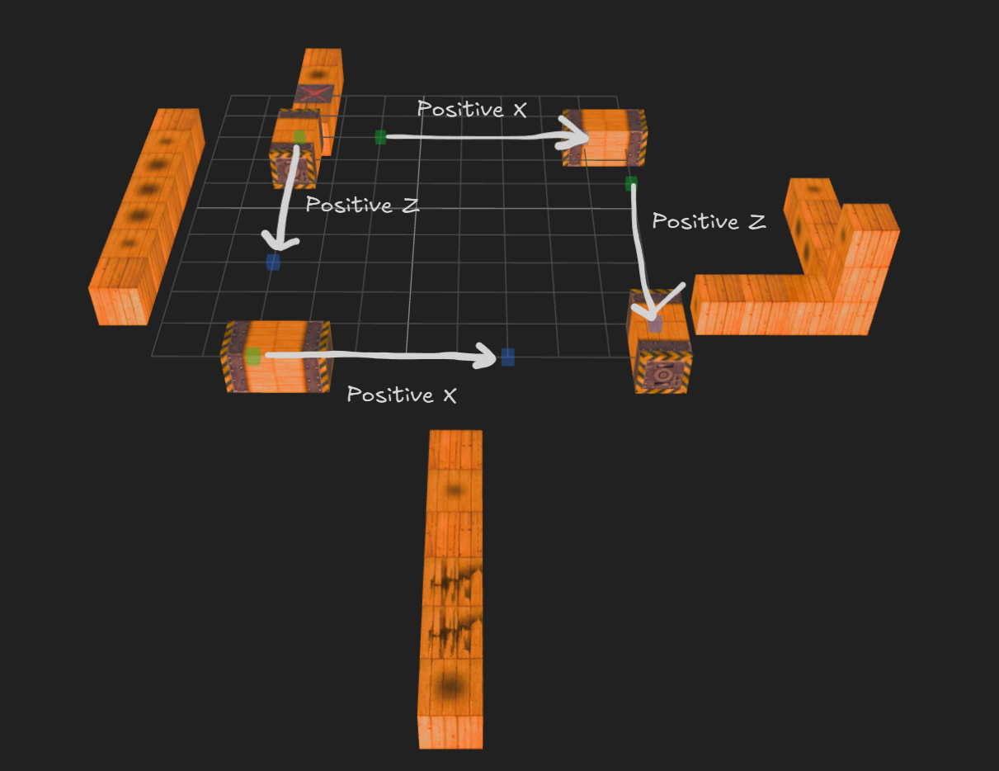

# Level Format

A custom binary format for storing level information.

<div class="warning custom-block" style="padding-top: 8px">

This format is still under heavy research!

</div>

<div class="tip custom-block" style="padding-top: 8px">

This document contains information about the format structure of level files.
If you are interested in using tools to create your own, please visit [here](https://example.com).

</div>

## Overview

Kula Quest uses a custom binary format for storing level data.
This format does not have its own file extension, and is mostly the same across all versions of the games with slight differences.

All values are in [**little endian**](https://en.wikipedia.org/wiki/Endianness), and the following data types will be used:

| Encoding | Description           |
| -------- | --------------------- |
| i16      | Signed 16-bit integer |

## Structure

The format is comprised of the following structure:

- Block identifiers
- The amount of blocks and property count
- Block properties
- Optional level properties

| Offset(h) | Size  | Type             | Field            | Description                              |
| --------- | ----- | ---------------- | ---------------- | ---------------------------------------- |
| 0x00      | 78608 | i16[34^3]        | block_ids        | Identifiers for every block in the level |
| 0x13310   | 2     | i16              | block_count      | Amount of blocks in the level            |
| 0x13312   | 2     | i16              | unused           | Unused                                   |
| 0x13314   | 2     | i16              | property_count   | Amount of properties in the level        |
| 0x13316   | -     | property[]       | properties       | Block properties                         |
| -         | 256   | level_properties | level_properties | Level properties (Optional)              |

## Block Identifiers

Every level in the game is essentially a 34x34x34 grid of blocks, with some blocks containing extra properties.
The first block is defined at the top, left, back corner of the level, which is at coordinate **0, 0, 0**.
The last block ends at the bottom, right, front corner of the level, which is at coordinate **33, 33, 33**.

- X indicates left and right.
- Y indicates up and down.
- Z indicates forward and backward (depth).

The first **78608** bytes of the file indicate which block in the grid is of what type.
Every 2 bytes indicate a single block, each time incrementing the Y position.
This continues until the Y position exceeds 33, where it's reset back to 0 and the Z position is incremented.
Once the Z position exceeds 33, the X position is incremented and Y and Z are reset back to 0.
These blocks are read until the position of the file reaches the end of the **block identifier section**, which is at offset **0x13310** (which as stated previously is the size of this section).

Here is a table defining what the 2 byte identifier represents:

| ID         | Type                                                                                                               |
| ---------- | ------------------------------------------------------------------------------------------------------------------ |
| -1         | An air block, or nothing. Nothing at all is placed here, and is completely ignored.                                |
| 0          | A block with no special properties at all; i.e. a block that doesn't contain any objects or is of a specific type. |
| 1          | A fire block, which is just a normal block but with fire patches on all sides with no objects or properties.       |
| 2          | Same as above, but as an ice block.                                                                                |
| 3          | Same as above, but as an invisible block.                                                                          |
| 4          | Same as above, but as an acid block.                                                                               |
| 5 or above | A block that contains special properties. See below.                                                               |
| -2         | Reserved for laser segments, in memory usage only.                                                                 |

Any value that is **5** or greater indicates a block with special properties and has corresponding [property data](#property-list), such as a crumbling or laser block, or a block that contains items and/or objects.
The first block of this type must start at **5**, and is incremented for every next special block.

## Position Types

There are 2 types of positioning used in this format — **block coordinates** and **entity coordinates**.
Here's an example of the different coordinates:

- `11 00 10 00 11 00` - Block Coordinate
- `00 22 00 20 9C 20` - Entity Coordinate

The block coordinate system is mainly used for positioning block properties and block positioning in general.
Objects and entities in game that need to use finer position values use the entity coordinate system, such as the ball and the current moving block position.

An entity coordinate value is **double** the amount of a block coordinate value, and the bytes are swapped, with the first byte as fine tune.
In the example above, we have a block with an item using the block coordinate and a ball on top of the same block using the entity coordinate.
The X and Z values are the same, while the Y coordinate is slightly above the block.

Here are the two different structures used throughout this document to define the type of positioning used:

### Block Position

| Offset(h) | Size | Type | Field | Description |
| --------- | ---- | ---- | ----- | ----------- |
| +0x00     | 2    | i16  | x     | X position  |
| +0x02     | 2    | i16  | z     | Z position  |
| +0x04     | 2    | i16  | y     | Y position  |

> Also referenced as **Position_block_t** in structures.

### Entity Position

| Offset(h) | Size | Type | Field | Description                 |
| --------- | ---- | ---- | ----- | --------------------------- |
| +0x00     | 2    | i16  | x     | X position (more precision) |
| +0x02     | 2    | i16  | z     | Z position (more precision) |
| +0x04     | 2    | i16  | y     | Y position (more precision) |

> Also referenced as **Position_entity_t** in structures.

## Property List

As stated above, there are a lot of different types of special blocks used in the game, and each one needs additional information defined below at the end of the file, right after the block data section (**0x13310**). Each property is a chunk of **256 bytes**. As an example, here is the first property in the first level of HIRO:

```
013310h   14 00 00 00 06 00 00 00 07 00 00 00 00 00 02 00
013320h   FF FF FF FF FF FF 00 00 F4 01 01 00 FF FF FF FF
013330h   FF FF 1E 00 FF FF FF FF 00 00 FF FF FF FF 00 00
013340h   FF FF FF FF FF FF 00 00 FF FF FF FF FF FF FF FF
013350h   FF FF FF FF FF FF FF FF 00 00 FF FF FF FF 00 00
013360h   FF FF FF FF FF FF 00 00 FF FF FF FF FF FF FF FF
013370h   FF FF FF FF FF FF FF FF 00 00 FF FF FF FF 00 00
013380h   FF FF FF FF FF FF 00 00 FF FF FF FF FF FF FF FF
013390h   FF FF FF FF FF FF FF FF 00 00 FF FF FF FF 00 00
0133A0h   FF FF FF FF FF FF 00 00 FF FF FF FF FF FF FF FF
0133B0h   FF FF FF FF FF FF FF FF 00 00 FF FF FF FF 00 00
0133C0h   FF FF FF FF FF FF 00 00 FF FF FF FF FF FF FF FF
0133D0h   FF FF FF FF FF FF FF FF FF FF FF FF FF FF FF FF
0133E0h   FF FF FF FF FF FF FF FF FF FF FF FF FF FF FF FF
0133F0h   FF FF FF FF FF FF FF FF FF FF FF FF FF FF FF FF
013400h   FF FF FF FF FF FF FF FF FF FF FF FF FF FF FF FF
```

### Object Block <Badge type="info" text="0-4" />

The following structure below applies to blocks that contain **objects**, i.e. anything that is assigned to a specific side of a block like items and traps. [Moving](#moving-block), [crumbling](#crumbling-block), [flashing](#flashing-block), and [laser](#laser-block) blocks follow a different structure, and have dedicated sections respectively below.

| Offset(h) | Size | Type                                  | Field         | Description                       |
| --------- | ---- | ------------------------------------- | ------------- | --------------------------------- |
| +0x00     | 2    | i16                                   | block_type    | Type of block                     |
| +0x02     | 32   | <a href="#object-property">object</a> | object_top    | Object on the top of the block    |
| +0x22     | 32   | <a href="#object-property">object</a> | object_right  | Object on the right of the block  |
| +0x42     | 32   | <a href="#object-property">object</a> | object_front  | Object on the front of the block  |
| +0x62     | 32   | <a href="#object-property">object</a> | object_back   | Object on the back of the block   |
| +0x82     | 32   | <a href="#object-property">object</a> | object_left   | Object on the left of the block   |
| +0xA2     | 32   | <a href="#object-property">object</a> | object_bottom | Object on the bottom of the block |
| +0x194    | 56   | -                                     | padding       | Padding (set to -1)               |
| +0x250    | 6    | position_block                        | position      | The block's position              |

#### Object Property

Each object contains **32 bytes** of information:

| Offset(h) | Size | Type | Field     | Description                      |
| --------- | ---- | ---- | --------- | -------------------------------- |
| +0x00     | 2    | i16  | id        | Object identifier                |
| +0x02     | 2    | i16  | direction | Object direction                 |
| +0x04     | 2    | i16  | variant   | Object variant                   |
| ...       |      |      |           | _See struct for complete layout_ |

```c
struct BlockObject_t {
    i16_t id;
    i16_t direction;
    i16_t variant;
    i16_t state;
    i16_t objectIndex;
    i16_t targetProp1;          // buttons and transporters only
    i16_t targetProp2;          // buttons and transporters only
    i16_t animationModelIndex;  // memory only (related to vertex buffer index)
    i16_t y;                    // only required in demos
    i16_t rotationType;         // only required in demos
    i16_t animationValue1;      // memory only
    i16_t animationValue2;      // memory only
    i16_t animationValue3;      // memory only
    i16_t rotationSpeed;        // only required in demos
    i16_t animationCounter;     // memory only
    i16_t animationState;       // memory only
};
```

<div class="tip custom-block" style="padding-top: 8px">

A table documenting every single object and their properties is available [here](/formats/objects).

</div>

Every object has a completely unique **ID** that indicates what item to put there, with some having different **variants** as well.
For example, a coin has the ID of `0x25` with the following variants: **Bronze, Gold, and Blue**.
An object can have several states as well, such as a transporter being turned on or off.

Some objects use the **direction** field, such as arrows that utilize this value for the direction they face.

Although not required as it's automatically set in memory, the **object index** is incremented from 0 after every object.
The first two demos require the **y position**, **rotationType**, and **rotationSpeed** fields to be set correctly, as they determine how far an object is above the block and how it's animated.
The fields are ignored in later versions of the game as they're hardcoded in the game's programming.

The **animation values**, **counter**, and **state** fields are not set in file, and are automatically populated and used in memory.

Lastly are the two **target property** fields, which are only used by transporters and buttons. These two fields specify what object(s) to toggle when the transporter or button is powered or unpowered (toggled), and where the transporter will send the player to, respectively. They both act as positions, and follow this principle:

```c
short propertyIndex;
short side;
ushort position = (propertyIndex * 16) + side;
```

As an example, let's look at some location data: `D0 01` and `72 01`. The first location is at index **29**, as the maximum value for the first byte is `F0` (16), and the second byte is incremented due to 29 > 16, which leaves 13, and translates to `D0` in hex. Since only the first digit in the byte represents the index, it would be `D0 01`. Lastly, the second digit in the first byte is 0, which targets the top side of the block.

Using this knowledge, the index of the second location is **23**, which is `70 01`. Since the side we want to target in the second location is 2, the second digit is the first byte is set as such, leaving us with `72 01` as a result. Both of these locations target the **top** side of the block with the **29th property**, and the **right** side of the block with the **23rd property**, respectively.

It's worth noting that in the first demo, buttons power themselves when pressed and only contain one slot, being **target property 1**. In all other versions of the games, buttons have two slots and **do not** power themselves when pressed. This means buttons themselves need power, so often times one of the slots are used to power itself. However, it's worth noting that only the **target property 2** can be used to power the button itself.

### Moving Block <Badge type="info" text="5" />

```c
struct BlockProperty_Moving_t {
    short blockType = 5;
    short direction;
    short axis;
    short unknown;
    Position_Block_t position1;
    Position_Block_t position2;
    short padding[6];
    short unknown;
    short length;
    short speed;
    short padding;
    short blockID;
    short padding[98];
    Position_Entity_t currentPosition;
    short unknown[3];  // Always set to: 00 01 00 01 00 01
};
```

The moving block contains 3 position values:

- **Position 1** - Specifies one of two points that the block will move between during the level. This position must be **before** position 2 along an axis.
- **Position 2** - Specifies the other one of two points that the block will move between, and must be positioned **after** position 1.
- **Starting Position / Current Position** - Specifies what position the moving block will start at when the level is started. This means that the moving block can actually start at a different point along the axis than the two positions specified, though in most cases (and in all cases from the game) this position is usually the same as one of the two points above.



Based on the example level seen above, position 1 (green) is always first along the axis than position 2 (blue), regardless of what direction the block is set to.

The direction specifies what direction the block will initially move towards on the axis:

- `00 00` indicates Negative Y.
- `01 00` indicates Positive X.
- `02 00` indicates Positive Z.
- `03 00` indicates Negative Z.
- `04 00` indicates Negative X.
- `05 00` indicates Positive Y.
- Any other value causes the moving block to not move at all.

The **axis** of the moving block indicates what axis it is on, and how the texture is wrapped onto the block. If this value is not set correctly, the block's collision will not work properly and will often crash the game.

- `00 00` indicates Y axis.
- `01 00` indicates X axis.
- `02 00` indicates Z axis.
- Any other value defaults to Y axis.

The **speed** indicates how many times the current position is incremented or decremented per frame depending on if it's moving in a positive or negative direction, respectively. Lastly, the **block ID** is set to the block ID that represents this property in the block data section.

---

A single block is placed at the starting position, which is known as the **origin**. Based on the length, that many blocks including the origin will be placed on the **positive** axis, e.g. if the direction is set to Negative X, the additional blocks will still be placed in the Positive X direction.

For example, if the block length is **1**, no other blocks will be placed as the origin block is apart of the length. If the length is **3** and the direction is set to **1**, **2 blocks** will be placed in the **Positive X** direction. The maximum length a moving block can be is **4**, as the texture data the block stores in memory inside its property overwrites other information about the moving block, as well as the next property.

### Crumbling Block <Badge type="info" text="6" />

| Offset(h) | Size | Type            | Field      | Description       |
| --------- | ---- | --------------- | ---------- | ----------------- |
| +0x00     | 2    | i16             | block_type | Block Type (6)    |
| +0x00     | 2    | i16             | state      | State (6)         |
| +0x02     | 6    | position_entity | position   | Position (entity) |
| +0x04     | 240  | -               | padding    | Padding           |
| +0x02     | 6    | position_block  | position   | Position (block)  |

```c
struct BlockProperty_Crumbling_t {
    short blockType = 6;
    short state = 1;
    Position_Entity_t position;
    short padding[120];
    Position_Block_t position;
};
```

Crumbling blocks have the following state values, although they should be set to **1** in file:

- **0** indicates the crumble block is gone.
- **1** indicates the crumble block is active.
- **2** indicates the crumble block is crumbling, but is not used.
- **3** indicates the crumble block is crumbling.
- Any other value causes the crumble block to still be active, but will not make a sound when touched.

The crumble block contains entity positioning, and are set as the exact block coordinate of the crumble block, even though it seems to not have an effect in game when changed to a different value. The **240 bytes** of padding are usually set to **-1**, but strangely enough some crumble blocks have object block data and other weird structures. Although they have no effect, it's still interesting to see that maybe some crumble blocks were intended to contain objects as well.

### Flashing Block <Badge type="info" text="7" />

```c
struct BlockProperty_Flashing_t {
    short blockType = 7;
    short index = -1;    // memory only
    short sync;
    short state = -1;    // memory only
    short counter = -1;  // memory only
    short padding[120];
};
```

Similar to moving spikes, flashing blocks also contain a **sync** value, which can be between **0 and 3** and specifies in what order of timing the flashing block will appear. Occasionally, just like crumble blocks, the **240 bytes** of padding may contain weird structures, but have no affect at all.

### Laser Block <Badge type="info" text="8" />

```c
struct BlockProperty_Laser_t {
    short blockType = 8;
    short unknown;
    short direction;
    short enabled;
    Position_Block_t position1;
    Position_Block_t position2;
    short padding[7];
    short unknown = 1;
    short padding[2];
    short blockID;
    short padding;
    short color;
    short targetProp;
};
```

Position 1 and 2 specify the two points of the laser. Similar to the [moving block](#moving-block), position 1 must always come before on the axis than position 2. If one of the positions are set to a block that isn't actually present in the level, the game will automatically create a normal block in its place.

The direction specifies the direction of the laser:

- `00 00` indicates Negative Y.
- `01 00` indicates Positive X.
- `02 00` indicates Positive Z.
- `03 00` indicates Negative Z.
- `04 00` indicates Negative X.
- `05 00` indicates Positive Y.

The **color** property follows the same structure that transporters and buttons do, and can be viewed [here](/formats/objects#color). Changing the color actually indexes into the laser's different textures, as each color is its own texture, so setting the value other than 4 changes to textures beyond the boundary, and the game will crash upon turning it on.

**Enabled** specifies whether the laser block is enabled by default when the level is started. Same as moving blocks, laser's also contain a **block ID** field that should be set to the block ID that represents this property in the block data section.

Lastly, laser blocks contain a **target property** field for specifying which block and face to toggle when the laser's power is toggled, similar to transporters and buttons.

### Level Flag Property <Badge type="info" text="9" />

The flag property is optional and if set is always behind the level information property. This property is used for setting flags for the level and does not tie to any block at all:

```c
struct LevelFlagProperty_t {
    short id = 9;
    short isHidden;
    short isReverseInvisible;
    short padding[122];
};
```

This property is very simple and only has two flags, which are set to true or false depending if they're set to 1 or 0 respectively. The first flag specifies if the current level is a **hidden level**, and the second flag specifies if the current level uses **reverse-invisible blocks**.

Similar to crumble and flashing blocks, this property usually contains **a lot** of weird structures in its padding, and sometimes this property is added to a level that doesn't use any of its flags.

```
014010h   11 00 11 00 11 00 09 00 00 00 00 00 00 00 00 00
014020h   00 00 00 00 FF FF 00 00 FF FF FF FF FF FF FF FF
014030h   FF FF FF FF FF FF FF FF 00 00 FF FF FF FF 00 00
014040h   FF FF FF FF FF FF 00 00 FF FF FF FF FF FF FF FF
014050h   FF FF FF FF FF FF FF FF 00 00 FF FF FF FF 00 00
014060h   FF FF FF FF FF FF 00 00 FF FF FF FF FF FF FF FF
014070h   FF FF FF FF FF FF FF FF 00 00 FF FF FF FF 00 00
014080h   FF FF FF FF FF FF 00 00 FF FF FF FF FF FF FF FF
014090h   FF FF FF FF FF FF FF FF 00 00 FF FF FF FF 00 00
0140A0h   FF FF FF FF FF FF 00 00 FF FF FF FF FF FF FF FF
0140B0h   FF FF FF FF FF FF FF FF 0A 00 00 00 00 00 01 00
0140C0h   FF FF FF FF FF FF 00 00 00 01 03 00 FF FF FF FF
0140D0h   FF FF 00 00 FF FF FF FF FF FF FF FF FF FF FF FF
0140E0h   FF FF FF FF FF FF FF FF FF FF FF FF FF FF FF FF
0140F0h   FF FF FF FF FF FF FF FF FF FF FF FF FF FF FF FF
014100h   FF FF FF FF FF FF FF FF FF FF FF FF FF FF FF FF
014110h   11 00 13 00 11 00 ..
```

Take this property from **LEVEL 31** as an example. We can see that it's definitely a flag property, but doesn't have any of its flags set. Even stranger however, we can see that it contains data for a bounce pad on the underside of the block, and even has a block position set for it in the next property. It is unknown why this occurs, but it does not have an affect on the level at all.

### Level Info Property <Badge type="info" text="666" />

At the end of the level binary, there is an extra property that contains basic information about the level itself. Most of these values are unknown and do not seem to have an affect on the level at all. This property has a block type of **666**, but is not tied to any block.

<Note>
    Some levels do not contain this property, notably the first Kula Quest demo.
    This property is not required, so the game will default to specific values
    if this property is not present.
</Note>

```c
struct LevelInfoProperty_t {
    short id = 666;
    Position_Block_t unknown;
    short unknown[2];
    short startTime;
    short padding[121];
};
```

Based on my research, there is evidence to suggest that the **unknown block position** value is a metadata position value based on the **last modified block** in Kula Quest's original level editor:

1. A fruit was accidentally placed in Kula World's FINAL 3 level. As final levels are not supposed to contain fruit, this object was removed in the Roll Away release of the game.
   This unknown position value just so happened to update to the removed fruit's block position.
2. A change was made for LEVEL 133 on the Kula Quest release to the green gem where it was moved from the fire block to in front of the key. The unknown position value also updated
   to the block that the gem was moved to.
3. In the first level of the game, this position value points to the block that contains the farther right bronze coin, which happened to be moved forward and changed from a gold to a bronze coin from earlier versions of the game.

This is just some examples, but one could reasonably conclude that this position value was likely metadata as it is **never** referenced from within the game's programming. The two **unknown short** values before the start time value are also ignored in game, but seem to be always in multiples of 5 and sometimes negative.

The only confirmed value in this property is the **start time**, which specifies the amount of time the level starts with in seconds. The game calculates the amount of time by multiplying this value by **50**, which is the PAL's game framerate. For reference, the game decrements `currentTime` every frame of unpaused gameplay, and ends the level if it reaches 0.

In Kula World and Roll Away, the time is calculated by multiplying this value by **50**, which is the framerate of the PAL version:

```c
// SLUS_007.24: 0x35F5C
// currentTime: 0xA573C

// checks if the block's type is 666, meaning the level info property exists;
// if so, set currentTime to the property's 6th index (startingTime) * 50.
if (*propertyData == 0x29a) {
    currentTime = propertyData[6] * 0x32;
}

// if the level info property doesn't exist, default to 4950.
else {
    currentTime = 0x1356;
}
```

_Kula World and Roll Away function the same here, so Roll Away is used as an example._

In Kula Quest, the time is calculated by multiplying this value by **60**, which is the framerate of the NTSC version. An additional check was added if the value is **5940**, which is the maximum time value (99) and is set to **7140** if so to allow additional level time:

```c
// SCPS_100.64: 0x362C4
// currentTime: 0xA12EC

// checks if the block's type is 666, meaning the level info property exists;
// if so, set currentTime to the property's 6th index (startingTime) * 50.
if (*propertyData == 0x29a) {
    currentTime = propertyData[6] * 0x3c;
}

// if the level info property doesn't exist, default to 4950.
else {
    currentTime = 0x1be4;
}

// if the currentTime was set to 5940, default to 7140 to allow more time.
if (currentTime == 0x1734) {
    currentTime = 0x1be4;
}
```
