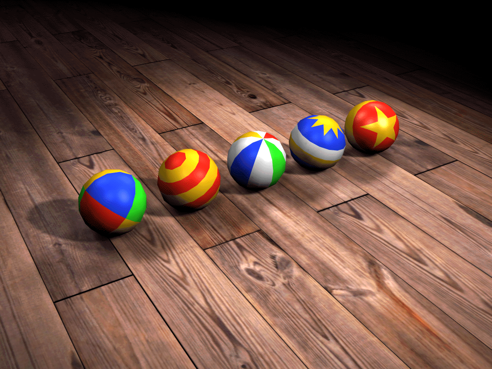

# Introduction

Welcome! This website contains documentation derived from countless hours of reverse engineering and research into the PlayStation 1 game **Kula Quest**.

> Source: https://kulaquest.pinkgothic.com/graphics.html

 

Throughout this documentation, the game will be referred to as **Kula Quest** as it was the original name and was [intended](https://kulaquest.pinkgothic.com/storybehind.html) to be known as such all over the world, despite most people knowing it as Kula World. The other titles will be used in cases of version differences as needed.

## Tools

Documentation relating to tools that have been developed to create or modify formats are available here.

    <CardLink title="Quilt" description="A command-line utility for modifying archive files and compression used in Kula Quest." link="/tools/quilt" />
    <CardLink title="MKSFX" description="A command-line utility for modifying SFX files from Kula Quest." link="/tools/mksfx" />

## Formats

Technical documentation is available for most of Kula Quest's custom binary formats.

    <CardLink title="Pak Format" description="An archive format for storing multiple files." link="/formats/pak" />
    <CardLink title="Kub Format" description="An archive format for storing multiple files in the oldest demo." link="/formats/kub" />
    <CardLink title="Level Format" description="A custom binary format for storing level data." link="/formats/level" />
    <CardLink title="SFX Format" description="A custom binary format for storing sound information." link="/formats/sfx" />
    <CardLink title="TGI Format" category="In Progress" description="A custom binary format for storing theme information." link="/formats/tgi" />
    <CardLink title="GGI Format" category="In Progress" description="A custom binary format for storing model and sprite information." link="/formats/ggi" />

## Credits

This website was created and maintained by the original creators of [Kula Workshop](https://www.kulaworkshop.net/).

<VPTeamMembers size="small" :members="members" />
